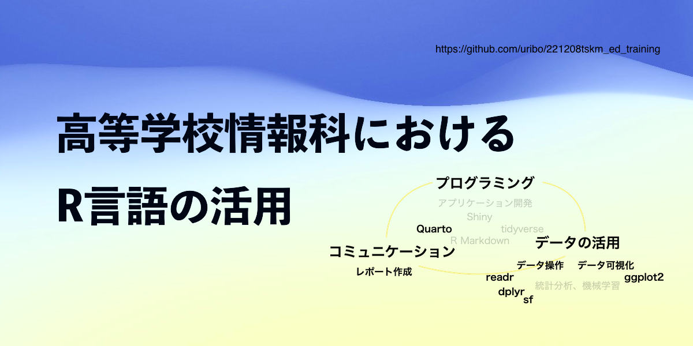

# 徳島県教科情報指導者研修「高等学校情報科におけるR言語の活用」



[](https://mybinder.org/v2/gh/uribo/221208tskm_ed_training/main?urlpath=rstudio)

## 概要

このページは、令和4年度（2022年度）徳島県教科「情報」指導者研修のための資料です。 R言語によるプログラミングを通し、教科「情報」で扱われるいくつかの単元の内容を学びます。 具体的には、「プログラミング」、「[データの可視化](https://uribo.github.io/221208tskm_ed_training/plot.html)」、「[オープンデータの活用](https://uribo.github.io/221208tskm_ed_training/shelter.html)」を扱います。 また[Quarto](https://quarto.org)を使った[レポート作成](https://uribo.github.io/221208tskm_ed_training/report.html)についても解説します。

### 研修の進め方

研修内容は[ウェブページ](https://uribo.github.io/221208tskm_ed_training/)または[スライド](https://github.com/uribo/221208tskm_ed_training/blob/main/slide/研修資料_高等学校情報科におけるR言語の活用.pdf)から閲覧可能です。 研修を通して[R言語](https://cran.r-project.org)によるプログラミングを行います。

R言語の実行環境は各自のコンピュータ上に構築していただくことが望ましいですが、 当日の研修では[binder](https://mybinder.org)を利用します。binderはウェブブラウザ上で実行可能なRの環境を提供します。以下のボタンをクリックまたはURLから直接リンクいただくことでbinderが起動します。 そのまましばらく待つとRStudio (Server)の画面に切り替わるので、そこからRを操作します。

[](https://mybinder.org/v2/gh/uribo/221208tskm_ed_training/main?urlpath=rstudio)

https://mybinder.org/v2/gh/uribo/221208tskm_ed_training/main?urlpath=rstudio


手元のコンピューター上で行うためには、必要なファイル一式をダウンロードして操作を行います。
これにはRとRStudioがインストールされていることが前提となります。

このページ https://github.com/uribo/221208tskm_ed_training の上部にある緑色の"Code"ボタンをクリック、 さらにDownload ZIPをクリックしてzipファイルをダウンロードします。 zipファイルを展開、`221208tskm_ed_training.Rproj`ファイルをダブルクリックするとRStudioが起動します。

この状態ではRスクリプトを動かすためのパッケージがインストールされていないため、 次のコマンドをコンソールで実行します。

``` r
install.packages("renv")
renv::restore()
```

パッケージのインストールを促すメッセージが出力されるので、`y`をコンソール上で入力します。 パッケージのインストールが完了したら準備完了です。


### 講師

- [瓜生真也](http://github.com/uribo) - [徳島大学デザイン型AI教育研究センター](https://www.tokushima-u.ac.jp/ai/)・助教

### ライセンス

この資料は[クリエイティブ・コモンズ 表示 - 非営利 - 継承 4.0 国際 (CC BY-NC-SA 4.0) ライセンス](https://creativecommons.org/licenses/by-nc-sa/4.0/deed.ja)の下に提供しています。ただし、資料中のコード部分は[MITライセンス](https://opensource.org/licenses/MIT)の下に提供します。

## 研修の日程

2022-12-08\@online

## 内容に関する質問、指摘

改善のためにコメント等をいただけると幸いです。 コメントは[GitHub issues](https://github.com/uribo/221208tskm_ed_training/issues/new)から投稿をお願いします。
